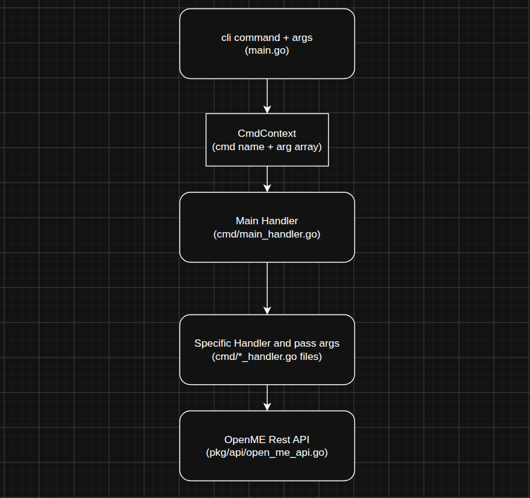

# CLI Project Structure

This document shows how the CLI project has been structured and responsibilities of different components.

## Folder Structure

```txt
cli
 | --> cmd
        | --> [Command Handlers Go files]
 | --> pkg
        | --> api
        | --> interfaces
        | --> models
 --> main.go
```

## What Each Directory Does

### cmd

This directory contains Go files that handle different commands that the cli exposes. Each `_handler.go` file has a function that takes an array of arguments as strings and returns a `CmdHandlerResult`.

### pkg

The pkg directory has the following directories:

- api - a module for calling the OpenME Rest API.
- interface - module for defining the api's implemented methods.
- models - module for api contructs used by the api.

### main.go file in root

This is the main entry point with `package main`. It is where the command line text is turned into a `CmdHandlerContext` struct, which is what command handlers in `cmd` directory understand how to use to execute a command.

## How A Command Is Handled

The Image below shows how a command gets handled by the cli:  
  

### Image Explained

- The main.go cli app recieves a command like `cmd [..args]`
- The main.go will transform this to a `CmdHandlerContext` struct.
- The `CmdHandlerContext` exposes the `HandleCommand()` function that main.go will call.
- The `HandleCommand()` will select the correct handler by using `cmd` property of the `CmdHandlerContext` struct.
- All known handlers expose a method that takes in an array of args and returns `CmdHandlerResult` struct.
- The `CmdHandlerResult` has a `ResultText` property which is what will get presented on the cli std output.
