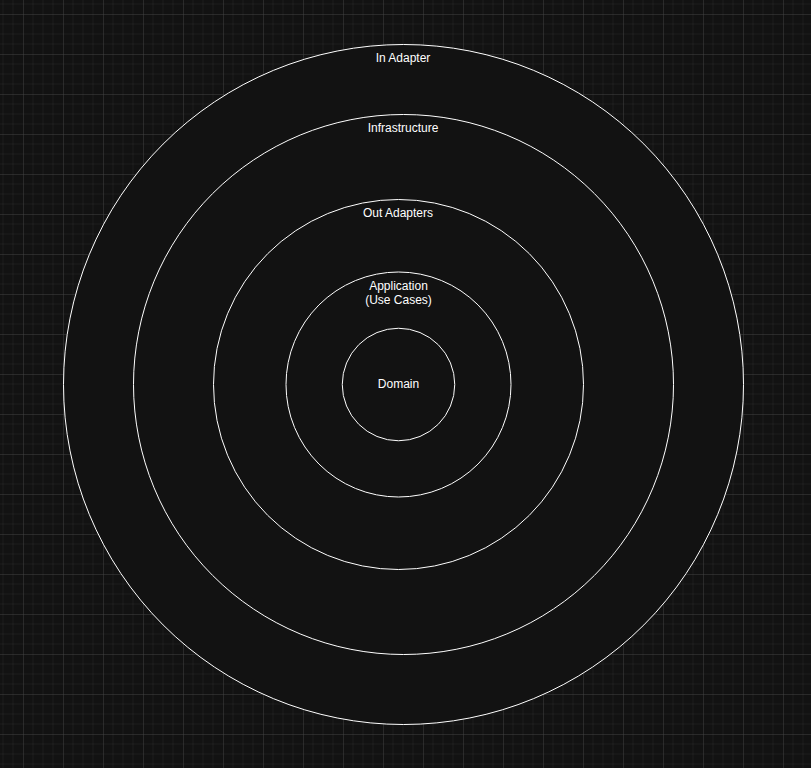

# Ports and Adaptors Architecture

This project structured using the Ports and Adapter Architecture.

The implementation is highly influenced by this [book](https://leanpub.com/get-your-hands-dirty-on-clean-architecture) by [Tom Hombergs](https://github.com/thombergs), really good read.

## Architecture Overview

Below is the mapping of this folder structure to the famous onion visualization of Clean Architecture  



## Folder Structure

In the folder structure, I try to use what we would term as screaming architecture.
This means my folder structure should map as closely as possible to architecture I am using.

The folder structure:  

```md
root
 | --> app/src
              | --> adapter
                     | --> in
                            | --> OpenME.WEB.API
                     | --> out
                            | --> OpenME.Data
              | --> infrastructure
                     | --> OpenME.Infrastructure
              | --> domain
                     | --> OpenME.Core.Domain
                     | --> OpenME.Core.Domain.Tests
              | --> applicaton
                     | --> OpenME.Core.Application
                     | --> OpenME.Core.Applicatio.Tests
 | --> cli
```

## What Each Directory Means

### Adapter

Adapters are modules that bring data into the software system, they are divided into two.  

`In Adapters a.k.a Driving Adapters` are what we use to interface with the application via a use case.  
In our case this is a REST API that has endpoints that correspond to use cases like creating a user etc.

`Out Adapters a.k.a Driven Adapters` are adapters that allow us to fetch data outside the domain and bring it into the application.  
In our example we have a data layer that at the time of writing is an in-memory datastore.

The Adapters use interfaces known as `Ports` to bring in data into the domain layer.  

The In Adapter uses IUseCase interfaces which are implimented in the domain app layer.
The Out Adapter implement interfaces defined in the application layer, this allows the IUseCases to have a way to pull in data without concerning itself with data implementation

### Infrastructure

This layer exists as a boostrapper for the application, this is where we have dependency injection etc.  
This layer has dependencies on all layers expect the In-Adapter as the In-Adapter needs to get service creation via DI.  

I would move configuration bits to this layer, it is mainly a building block between layers, no business logic.  

### Domain (Core)

This is the heart of the application, at the moment it only defines models that represent entities within the app.  
But one isn't only limited to that, this can be modelled with something like Domain Driven Design (DDD).

The models I have defined have some business rules in them to make sure when they get instantiated, the state is intact.  

## Application (Core)

This layer is where `Ports` interfaces are defined. The In Ports are implemented in this layer as `Services` so they can be consumed by the In Adapters.

Since this layer has use cases it also applies business rules need for those use cases to be fulfilled. This would be where most of the application's complex business rules get applied. It only has a dependency on the domain layer.

## CLI

This is where the CLI code lives, could've been a dir in the in adapters directory but I just thought it is fine to have the cli away from the main application etc.
