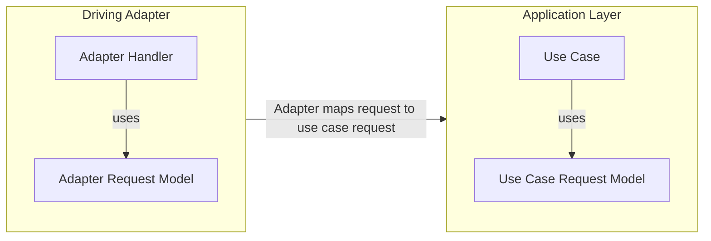

# Mapping Strategies

The are two types of mapping that essentially need to happen when moving data throughout the project.  
There is the "Driving mapping" and the "Driven mapping".

- `Driving mapping` - Talks to mapping data from outside into the domain usually via the use case.
- `Driven mapping` - Talks to the domain reaching out to get data (via a Port).

The idea of `Driving` and `Driven` is derived from the ports and adapters pattern where we have `driving adapters` that invoke a use case thus driving the behavior of the program and the `driven adapters` which act in response of the use cases needed data outside the domain i.e. database calls, rest APIs etc.

## Driving Mapping

The driving mapping is going to follow the `two-way mapping strategy`. This strategy is simple in the fact that each layer will have it's own model to send data (request) and it's own model to recieve data (response).  

The mapping strategy does create overhead but it is justified in by the fact that it makes it easier for us to have a CQRS model around getting data into the domain which will align nicely with use cases since will have models like `CreateUserRequest` that will come from adapter then get mapped to some use case model.

To illustrate how this mapping looks, we will see an example below

### Driving Mapping In Action

- The Driving Adapter will recieve data in whatever form is suitable for it i.e. `Adapter Request Model`.

- The Driving Adapter having a dependency of the application layer will be responsible to map it's request model into the `Use Case Request Model`

- After transformation the application layer will accept the `Use Case Request Model`

The good thing here is the request model can explictly state it's intent (CreateUserRequest) and only have adapter specific functions on the Adapter Layer (Http decorators if the adapter is web app)  

Then when recieved we can strip away Adapter specific functions on the model to the use case model expected by the application layer.

These models can evolve indepedetly if needs with the Adapter model not affecting how the use case (Domain component) changes.