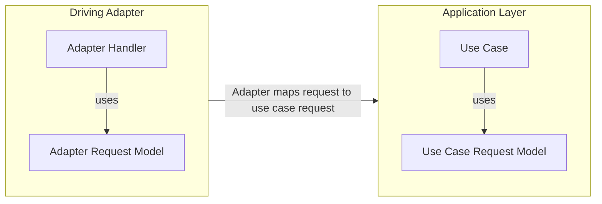
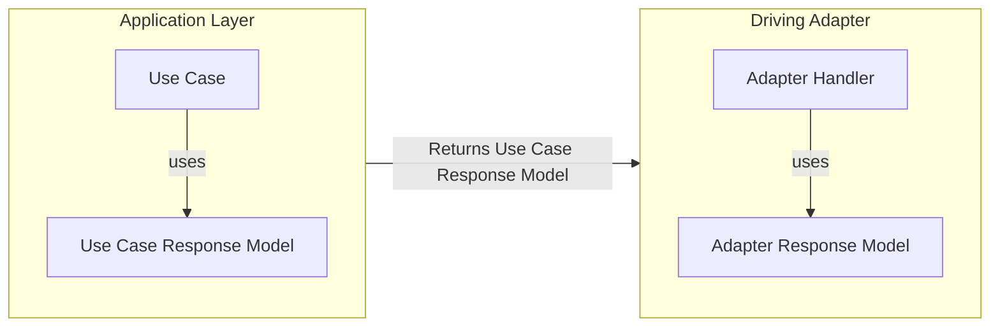
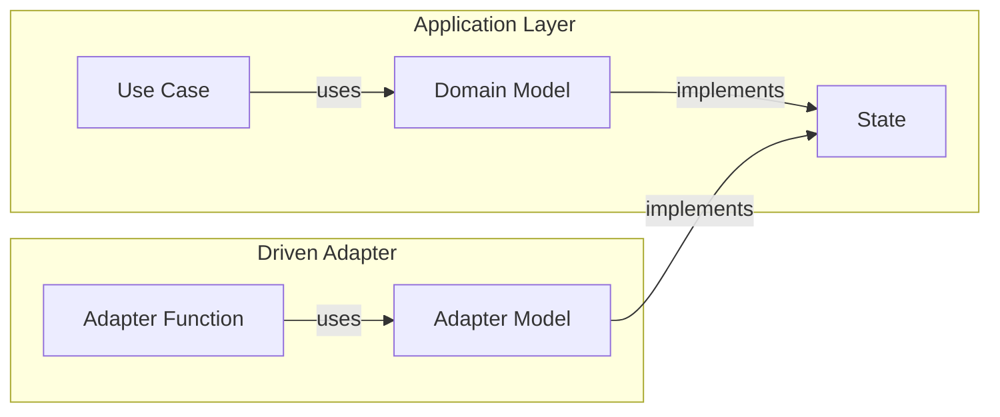
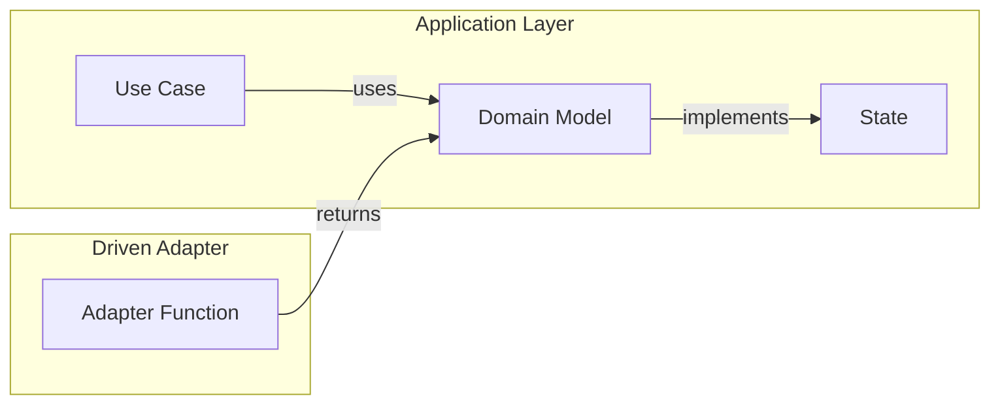

# Mapping Strategies

The are two types of mappings that essentially need to happen when moving data throughout the project.  
There is the "Driving mapping" and the "Driven mapping".

- `Driving mapping` - Talks to mapping data from in ports into the domain usually via the use case.
- `Driven mapping` - Talks to the domain reaching out to get data (via out ports).

The idea of `Driving` and `Driven` is derived from the ports and adapters pattern where we have `driving adapters` that invoke a use case thus driving the behavior of the program and the `driven adapters` which act in response of the use cases needing data outside the domain i.e. database calls, rest APIs etc.

## Driving Mapping

The driving mapping is going to follow the `two-way mapping strategy`. This strategy is simple in the fact that each layer will have it's own model to send data (request) and it's own model to recieve data (response).  

The mapping strategy does create overhead but it is justified in by the fact that it makes it easier for us to have a CQRS model around getting data into the domain which will align nicely with use cases since we will have models like `CreateUserRequest` that will come from adapter then get mapped to some use case model.

To illustrate how this mapping looks, we will see an example below.

### Driving Mapping In Action

#### Mapping Into the Domain (Use Case)

- The Driving Adapter will recieve data in whatever form is suitable for it i.e. `Adapter Request Model`.

- The Driving Adapter having a dependency on the application layer will be responsible to map it's request model into the `Use Case Request Model`

- After mapping, the application layer will accept the `Use Case Request Model`

The good thing here is that the request model can explictly state it's intent (CreateUserRequest) and have a model with adapter specific responsibilities on the Adapter Layer (Http decorators if the adapter is web app based etc)  

Then when recieved from the outside world, we can strip away Adapter specific functions on the model then map to the use case model expected by the application layer.

These models can evolve indepedetly if needs be, with the Adapter model not affecting how the use case (Domain component) changes.

#### Mapping From the Domain (Use Case)

- Similar to mapping into the domain, the Application and Adapter layers will have their own response models.

- The Application layer will always return the use case response model.

- The Adapter will recieve that model and transaform it into the Adapter Response Model.

In cases where the data returned is primitive (boolean, number, etc) no actaul mapping will happen and at best these response models can be 1-to-1 mappings.

The need for mapping might seem repitative but again our Adapter Response Model might have some Adapter specific concerns and we don't want those to spill into the Domain layer.

## Driven Mapping

For the driven mapping we use one way mapping (I think lol)

The driven mapping will happen in cases where the application / use case layer needs domain state data from external components like the database, so it can do something. Usually the State of a said domain model, this happens with things like `Out Ports`.

Out Ports are interfaces used by the domain to bring data into the domain layer, one good example is `GetUserPort` which would be a port to get a user's data from; say a database of sorts. These ports get implemented by what we call `Driven Adapters` i.e. Database Implementations / REST APIs which would naturally live outside the domain layer.  

The idea is that each domain model would have a state interface defined in the domain layer, in fact every domain model implements it's own state interface, then out ports would use that as a data contract between the Adapter and the domain for transfer of data.

The models defined in the out adapter will implement this interface if they need to do more than just get data.

The adapters are allowed to return two things the domain models which they can construct via the State they have or the State interface with data.

Since the `Domain -> Adapter direction` uses an interface no explict mapping is needed and the `Adapter -> Domian direction` returns either the state interface or the domain model (which is an implementation of the state interface) there's no explict mapping needed at all

The big knock here is that the Interface Segration Principle will be affected deeply since our State interface might have more data than a said adapter needs and this interface needs to grow to accomodate possibly more than one adapter / outport. Honestly this is a decision I am willing to take.

### Domain to Adapter

- The Domain Model will implement the State interface i.e. populate it with data

- The `Adapter Model` can easily read data from the interface since the port that will be implemented will be bringing in data via the State interface.

- The Adapter Model can then take the State interface and restructure it in a way that is suitable for the Adapter Functions, this is not mapping per se.

This works well for out ports (especially databases) because we are actually commuicating with the data layer using one contruct that remains true for whatever data layer implementation we have; the state of an entity.

I actually have no experience of this but it makes so much sense that state gets transfered to the data layer because that's what data layers work with, state.

Also for other driven adapters like rest api that maybe need a piece of the state like a user's email to do something getting, a whole load of state data is not ideal but works fine because what this interface communicates is `state of an entity` - which I think is actually pretty expressive.

### Adapter to Domain

- "Mapping" is easier for this direction since the Adapter can reconstruct the domain model using the State it has.

- The Use case can just expect the domain model back.

- The Adapter can also just return the State and the reconstruction of the domain model can happen in the application layer.

Honestly where the reconstruction happens doesn't matter the Domain Model should just have a constructor or public function that builds it up from the State.

The reconstruction should apply all business rules needed to make sure we have valid state.

If we want to be strict we can make the Domain Model internal to the Application layer only since it is the one with use cases so we can make sure BRs are executed in the right place.

Exposing the domain model to the Adapter means we can possibly trigger functions that we shouldn't in the data layer, but boohoo I can deal with that for now.
